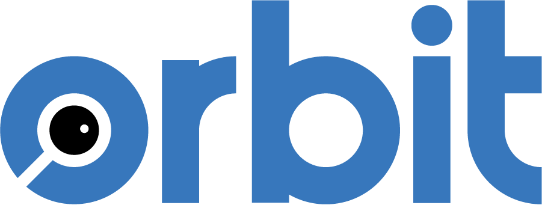

Orbit, the **O**pen **R**untime **B**inary **I**nstrumentation **T**ool, is a standalone **C/C++** profiler for Windows and Linux. Its main purpose is to help developers visualize the execution flow of a complex application.

The key differentiator with many existing tools is that no alteration to the target process is necessary. Orbit does not require you to change a single line of code. It doesn't require you to recompile or even relaunch the application you want to profile. Everything is done seamlessly, right when you need it. It requires zero integration time and zero iteration time.

Orbit combines sampling and dynamic instrumentation to optimize the profiling workflow. Sampling can quickly identify interesting functions to instrument. Dynamic instrumentation results in exact function entry and exit information which is presented in the form of per-thread hierarchical call graphs.  Scheduling events are also shown to visualize when a thread was running and on what core.

**Features**
- Dynamic Instrumentation (No Code Change Required)
- Robust Sampling
- Fast Debug Symbol Parsing
- Context Switch Tracking
- Disassembly View
- Remote Profiling
- User Sessions
- Full Serialization of Captured Data
- Tested on Unreal, Unity, Lumberyard, Qt, Doom3, PhysX, ...

**Note**

Orbit is undergoing a major overhaul. The focus has now shifted to the Linux version. Windows local profiling is currently broken in the master branch. It is possible however to profile Linux exectuable from a Windows UI instance. For Windows local profiling, please use the released [binaries](https://github.com/google/orbit/releases). Windows development will resume in the coming months.

**Build**

Please have a look at the first three sections of our [development documentation](DEVELOPMENT.md). It describes how to build Orbit and what Compilers, Platforms, and Tools are supported and needed.

**Workflow**
1. Select a process in the list of currently running processes in the "Home" tab.
2. The list of loaded modules will appear on the bottom of the "Home" tab.  If debug symbols were found for a module, it will be highlighted in blue.
3. Right click on the module(s) for which you want to load debug information and select "Load Symbols". The "Functions", "Types" and "Globals" tabs will get populated.
4. Select functions you wish to profile in the "Functions" tab by right clicking and choosing "Hook".
5. In the "Capture" tab, start profiling by pressing 'X'.  To stop profiling, press 'X' again.  You can zoom time using the scroll wheel.  To zoom vertically, hold 'CTRL' while scrolling.  You can also ctrl+right-click and drag to zoom time.  Press 'SPACE' to Zoom the last 2 seconds of capture.
6. When you select a function in the "Capture" view, the full callstack will be available in the "Callstack" tab.  You can select functions to be profiled in the callstack tab as well.  Also, if code is available on your machine, it will be displayed in the "Code" tab.
7.  You can select sections of the per-thread sampling event track to get a sampling report of your selection.

**Sessions**

Once you have loaded the debug information for your modules and have chosen functions of interest, you can save your profiling session so that you won't have to do this manually again.  To save a session, go to "File"->"Save Session"

**Feedback**

Questions and comments are more than welcome, please open an [issue](https://github.com/google/orbit/issues).

**About**

Orbit was created by [Pierric Gimmig](https://www.linkedin.com/in/pgimmig/) but is now actively developed and maintained by a team of engineers at Google.

License (BSD 2-clause)
======

	Copyright (c) 2020 Pierric Gimmig. All rights reserved.

	https://github.com/pierricgimmig/orbitprofiler

	Redistribution and use in source and binary forms, with or without
	modification, are permitted provided that the following conditions are met:

	   1. Redistributions of source code must retain the above copyright notice,
	      this list of conditions and the following disclaimer.

	   2. Redistributions in binary form must reproduce the above copyright
	      notice, this list of conditions and the following disclaimer in the
	      documentation and/or other materials provided with the distribution.

	THIS SOFTWARE IS PROVIDED BY COPYRIGHT HOLDER ``AS IS'' AND ANY EXPRESS OR
	IMPLIED WARRANTIES, INCLUDING, BUT NOT LIMITED TO, THE IMPLIED WARRANTIES OF
	MERCHANTABILITY AND FITNESS FOR A PARTICULAR PURPOSE ARE DISCLAIMED. IN NO
	EVENT SHALL COPYRIGHT HOLDER OR CONTRIBUTORS BE LIABLE FOR ANY DIRECT,
	INDIRECT, INCIDENTAL, SPECIAL, EXEMPLARY, OR CONSEQUENTIAL DAMAGES
	(INCLUDING, BUT NOT LIMITED TO, PROCUREMENT OF SUBSTITUTE GOODS OR SERVICES;
	LOSS OF USE, DATA, OR PROFITS; OR BUSINESS INTERRUPTION) HOWEVER CAUSED AND
	ON ANY THEORY OF LIABILITY, WHETHER IN CONTRACT, STRICT LIABILITY, OR TORT
	(INCLUDING NEGLIGENCE OR OTHERWISE) ARISING IN ANY WAY OUT OF THE USE OF
	THIS SOFTWARE, EVEN IF ADVISED OF THE POSSIBILITY OF SUCH DAMAGE.
