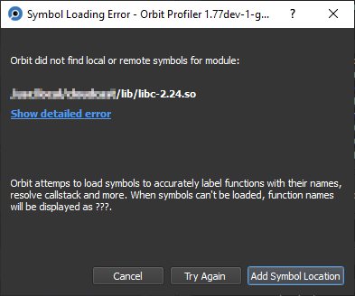
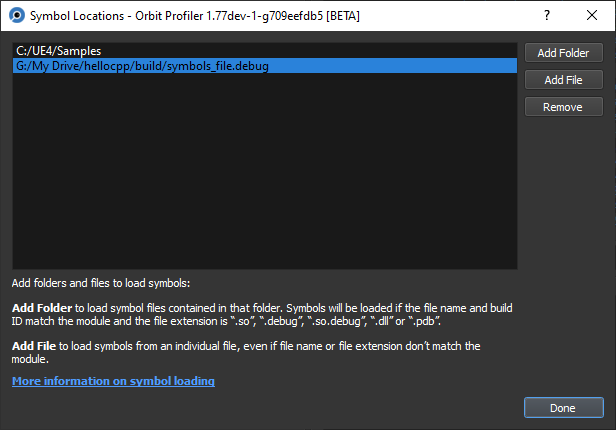
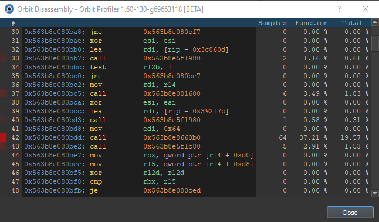
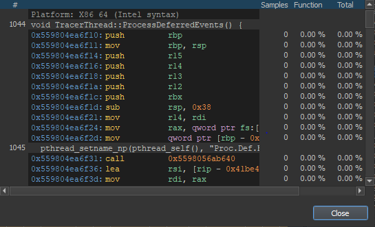
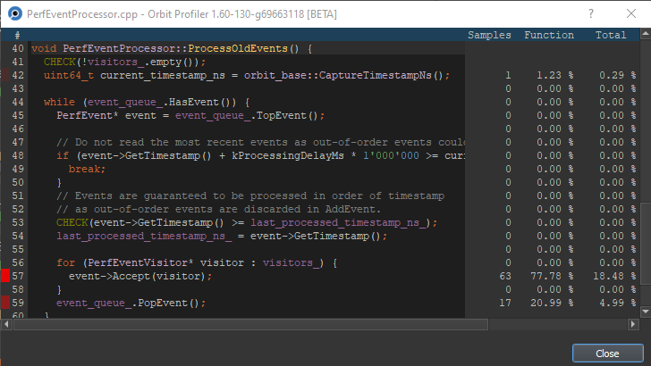
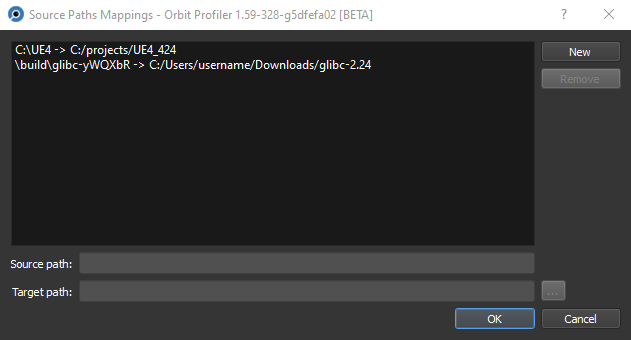
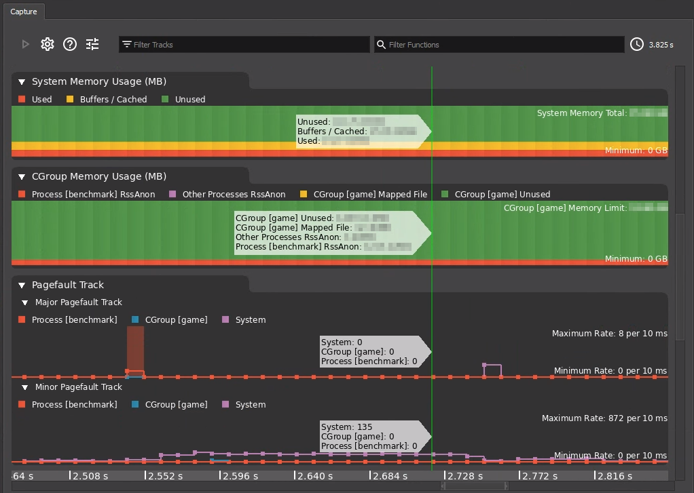

# Profile CPU with Orbit

Orbit is a CPU profiler that enables you to identify CPU-related performance
issues in your application. It allows you to take system traces and detailed CPU
performance data using callstack sampling, dynamic instrumentation, memory
tracing and GPU driver tracing (AMD only).

> **Note** Orbit is currently a beta version. If you run into issues or
have feature requests, consider creating an
[issue](https://github.com/google/orbit/issues/new/choose) or a
[pull request](https://github.com/google/orbit/compare)
([how to contribute](../CONTRIBUTING.md)).

> **Note** Orbit is now mainly a **Linux** profiler. Windows support is
> experimental and not all features are available on Windows.

## Prerequisites

You need to have `Orbit` and `OrbitService`
[built](../DEVELOPMENT.md#building-orbit) and
[running](../DEVELOPMENT.md#building-orbit).

> **Note** For reasonable feature support, `OrbitService` needs to run as
> **root** (or Administrator on Windows).

> **Note** For remote profiling support you can tunnel the TCP port `44765`
> through an SSH connection to an arbitrary Linux server.

## Profile your application

In this section, we will go through a capture session showing you how to select
your target process for profiling, dynamically instrument functions, and record
a capture. Note that captures are saved automatically.

### Connect Orbit

This section shows you how to select your target process for profiling or load a
saved capture.

> **Note** Your application must already be running on the target instance.

1. Launch `Orbit` and `OrbitService` as described
   [here](../DEVELOPMENT.md#building-orbit).
   Orbit will open the so-called **Connection Window** (screenshot below).

   ![Choose Process in Orbit][orbit_processes]
2. Select **Local profiling**.

   Once the connection gets established, the right pane shows the processes
   running on the target machine. Note that Orbit sorts processes by CPU usage
   and automatically selects the first process in the list.

   > **Note** If you previously profiled your application and saved a capture,
   > you can click **Load a capture** to directly load the capture from this
   > window. For ease of access, Orbit maintains a list of captures that you
   > saved recently.

3. To confirm the selected process and continue to the main window, click
   **Start Session** or <kbd>Double-Click</kbd> the process. In the
   **Main Window**, you can see the following:

   * The selected process and instance in green.
   * The **Modules** section in the **Symbols** tab displays all the loaded
   modules for the process, including your application binary and all libraries
   that your application uses. Orbit attempts to load symbols for all modules
   automatically. You can see the state of symbol loading in the first column of
   the **Modules** section.

   ![Orbit's main window with processes and modules][orbit_main_window_startup]

4. To return to the startup window and select a different process, or connect
   to a different instance, click **End Session**.

   > **Note** If you loaded a capture from file, the right side of the menu bar
   displays the filename of the capture instead of connection details.

### Record a capture with callstack sampling

This section shows you how to record a basic capture that samples callstacks in
your application.

1. On the left-hand side in the **Capture** tab, click
   
   to start taking a capture. After a few seconds, click
   
   to stop capturing. The capture looks like the screenshot below:

   ![Orbit default capture][orbit_main_window_default_capture]

   The **Sampling** tab automatically shows a report of the collected samples
   anytime a capture is stopped.

1. Click a row to select a function. You can inspect sampled callstacks that
   involve this function at the bottom.

The **Capture Options** dialog (click
)
lets you toggle between two methods of callstack unwinding: **DWARF**, the
default method, and **Frame pointers**. The **Frame pointers** method has much
less overhead and produces the same results as the **DWARF** method.

However, to unwind using frame pointers, you must compile *all* target binaries
(application and all libraries) with the `‑fno‑omit‑frame‑pointer` compiler flag.
Orbit still supports leaf functions (functions without a call instruction) that
do not set the frame pointer, which means it also supports binaries compiled
with `‑momit‑leaf‑frame‑pointer` (as long as `‑fno‑omit‑frame‑pointer` is used).
All application surface libraries that are part of a Stadia instance are already
compiled with `-fno-omit-frame-pointer -momit-leaf-frame-pointer`.

### Work with the Capture tab

After successfully taking a capture, the **Capture** tab presents a timeline
of all captured events. It consists of multiple tracks as shown:

![Orbit capture tab][orbit_capture_tab]

* Scheduler track (1): Displays the thread activity on all CPU cores,
obtained from context switch events. Threads started from the profiled process
are color-coded to match the according thread track. All other threads are
displayed in gray.
Note that you can click a thread to select it, in which case all but the
selected threads are grayed out in the **Scheduler** track.

* GPU tracks (2): Expose selected GPU driver events (AMD only). You see when
jobs are enqueued in the driver, when they are enqueued on the GPU hardware,
and when they are executed. Hold the pointer over a specific event to see more
information.

* Thread tracks (3): Show information about sample distribution and timings of
instrumented functions, grouped by thread ID. They consist of the following
elements:

  ![Thread track shows sample distribution and instrumented functions][orbit_thread_tracks]

  * Event bar (4): Shows all callstack samples taken in this
  thread. Click it to select the corresponding thread, or click and drag across
  the bar to select specific samples. This action populates the selection
  tabs in the right pane of Orbit, and you see selected samples in green.
  * White lines inside the event bar (5): Show samples taken in this thread.
  * Flamecharts below the event bar (6): Show exact timings for instrumented
  functions executed from this thread.

### Inspect callstack samples with the top-down view

This section shows you how to use the top-down view to analyze the call tree of
your application and the relative time spent in each function.

1. Take a capture as explained in
   [Record a capture with callstack sampling](#record-a-capture-with-callstack-sampling).

1. Click the **Top-Down** tab. The top-down view displays the call tree of your
   application, based on the callstack samples collected. The top-down view looks like
   the following screenshot:

   ![Orbit top-down view][orbit_main_window_top_down]

   At the top level, the tree is organized by thread. Expanding a thread
   displays its start function. Expanding a function shows its callees. The
   `<process name> (all threads)` node at the top level organizes all samples in
   the same hierarchical fashion, but without grouping by thread.

   For each function call, you see three values:

   - **Inclusive**: The number of samples in which this function call appears,
     and the percentage relative to the total number of samples. This represents
     the relative time spent in this function call and in all its callees.

     You can also see this value for each thread, in which case it represents
     the number of samples in this thread in relation to the total number of
     samples.

   - **Exclusive**: The number of samples in which this function call is at the
     top of the callstack, and the percentage relative to the total number of
     samples. This represents the relative time spent in this function call,
     excluding its callees.

   - **Of parent**: The percentage of inclusive samples for this function call
     in relation to the inclusive samples of the caller. This represents the
     impact of this function call on the time spent in the caller and its
     callees.

1. These are some actions that you can execute on the top-down tree and its
   nodes:

   - Use the <kbd>→</kbd> key to expand a node or to move to its children.

   - <kbd>Right-Click</kbd> an item and choose the corresponding action in the
     context menu to expand or collapse an entire subtree or the entire tree.

   - Use the context menu to load the module a function belongs to, hook a
     function, or bring up the disassembly of the function.

   - Use the **Search** field (
     
     ) to show all the nodes with functions that match the search, with those
     nodes being highlighted.

### Inspect callstack samples with the bottom-up view

This section shows you how to use the bottom-up view to analyze which methods or
functions your application spends the most time in, and which callers invoke
these functions most frequently.

1. Take a capture as explained in
   [Record a capture with callstack sampling](#record-a-capture-with-callstack-sampling).

1. Click the **Bottom-Up** tab. The bottom-up view displays a list of leaf calls
   and the tree of their callers using the collected callstack samples. The
   bottom-up view looks like the following screenshot:

   ![Orbit bottom-up view][orbit_main_window_bottom_up]

   At the top level, you see all the functions that appear at the top of a
   callstack. Expanding a function shows its callers; you can continue expanding
   each function until the start function of one or more threads. At the lowest
   level, you can expand the start functions to see the corresponding threads.

   Note that in the tree structure of the bottom-up view, the parent node of a
   function call is the *callee*, not the caller. This is opposite to the
   top-down view, where the parent node is the caller.

   For each function call, you see two values:

   - **Inclusive**: The number of samples in which this function call appears,
     and the percentage relative to the total number of samples. This represents
     the relative time spent in this function call and in all its callers.

     Note that for the functions at the top level (at the top of a callstack),
     this number also represents their "exclusive" count, essentially; that is,
     the number of samples in which this function call is at the top of a
     callstack.

   - **Of parent**: The percentage of inclusive samples for this function call
     in relation to the inclusive samples of the callee (parent node). This
     percentage shows how frequently the callee is invoked by this specific
     caller compared to all the callee's callers; alternatively, it shows the
     relative time spent in the callee (and its callees) when invoked by this
     one caller.

### Dynamically instrument functions for precise timing information

This section shows you how to dynamically instrument functions in a
library or your target binary to visualize timing information on the Orbit
timeline. Here is an example showing how to dynamically instrument some Vulkan
API calls:

1. Click the **Symbols** tab and search for **libvulkan.so** in the **Modules**
   pane.

2. Make sure the first column displays **Loaded** for **libvulkan.so**;
   otherwise, wait until symbol loading is finished.

   > **Note** If the first column displays **Error**, you can attempt to load
   > symbols again. <kbd>Right-Click</kbd> and select **Load Symbols**. For more
   > information about loading symbols, see [Load Symbols](#load-symbols).

3. In the **Functions** pane, search for **vkQueue**.

4. Select **vkQueueSubmit** and **vkQueuePresentKHR**, <kbd>Right-Click</kbd>
   them, and click **Hook**.

5. In the **Capture** tab, click
   
   to take a capture again. This time, any calls to the selected functions are
   displayed as events on the timeline on the left. Since the selected functions
   submit jobs to the GPU, you can see the corresponding GPU driver events on
   the GPU tracks. When zooming into the view, you see something like the
   following screenshot:

   ![Orbit capture with dynamic instrumentation][orbit_main_window_capture]

10. Click the **Live** tab to see all instrumented functions and statistics from
    the capture you have just taken.

> **Note** The **Capture Options** (click
)
> dialog lets you toggle between two methods of dynamic instrumentation -
> **Kernel (Uprobes)**, the default method, and **Orbit**. The **Orbit** method
> has much less overhead and produces the same results as the **Kernel
> (Uprobes)** method. Note that the **Orbit** method is still experimental;
> if you experience issues, please use the **Kernel (Uprobes)** method.

### Use presets of dynamically instrumented functions

A preset contains information about instrumented functions and their modules. If
you have previously profiled your application and saved presets, you would see a list
of the available presets in the **Presets** pane in the **Symbols** tab.

1. Select **File** > **Save Preset As...** to save a preset.

2. To apply the preset to the currently selected process, <kbd>Right-Click</kbd>
the preset in the **Presets** pane and select **Load Preset**. Alternatively, 
you can select **File** > **Open Preset**.

This action loads symbols for the modules and hooks the functions that are
stored in the preset.

If the process you want to profile is not using all modules in the preset, Orbit
applies the preset partially; it loads the modules used and hooked into all
functions from the loaded modules only.

You can apply several presets by loading them one by one.

### Use iterators to iterate over dynamically instrumented functions

You need to capture a profile with at least one dynamically instrumented
function as explained in [Dynamically instrument functions for precise timing information](#dynamically-instrument-functions-for-precise-timing-information).

In the following example, we use the **TestFunc2** function from our `OrbitTest`
application:

1. From the **Live** tab, <kbd>Right-Click</kbd> the row that shows stats for
   **TestFunc2**, and select **Add iterator(s)**.

   Note that the iterator snaps to the instance of **TestFunc2** that is
   closest to the center of the capture window.

2. Move the iterator in either direction by pressing the corresponding arrow
   button (
   
   or
   
   ).

You now see something similar to the following screenshot:

![Iterator to move from function call to function call][orbit_main_window_live_iterator]

> **Note** When you add multiple iterators, you can move all iterators at once
using the arrow buttons labeled **All functions**. This can be in particular
useful for defining frame boundaries and advancing whole frames. See
the next section [Use iterators to iterate over frames](#use-iterators-to-iterate-over-frames).

### Use iterators to iterate over frames

In the following example, we use the **vkQueuePresentKHR** of a Vulkan game as
frame boundary.

You need to have a profile captured where **vkQueuePresentKHR** is
dynamically instrumented (hooked) as explained in
[Dynamically instrument functions for precise timing information](#dynamically-instrument-functions-for-precise-timing-information).

Alternatively, you can use any function that you want to define your frame
boundaries.

However, we continue using **vkQueuePresentKHR** in the following example:

1. From the **Live** tab, <kbd>Right-Click</kbd> the row that shows stats for
**vkQueuePresentKHR**, and select **Add iterator(s)**.

2. Repeat the step above. We need two iterators to define the frame boundaries.

   Note that the iterators snap to the instance of a
   **vkQueuePresentKHR** call that is closest to the center of the capture
   window.

3. Click 
   to advance the second iterator by one step.

   Note that the area defined by these two calls is now shaded and the time
   difference for the current frame is shown.

4. Click the **All functions**
   
   or
   
   buttons to advance to the next or previous frame.

You now see something similar to the following screenshot:

![Iterators that define frame boundaries][orbit_main_window_live_frame]

> **Note** To show more detailed timing information for subparts of the computation
done for a frame, you can add additional iterators, ideally from functions that
are called exactly once per frame.

### Use frame tracks to identify long frame times

You can use any other instrumented function to define a frame. In the following
example, we use **vkQueuePresentKHR** from **libvulkan.so** as a frame marker.

1. Click the **Symbols** tab and search for **libvulkan.so** in the **Modules**
   pane.

2. Make sure the first column displays **Loaded** for **libvulkan.so**;
   otherwise, wait until symbol loading is finished.

   > **Note** If the first column displays **Error**, you can attempt to load
   > symbols again. <kbd>Right-Click</kbd> and select **Load Symbols**. For more
   > information about loading symbols, see [Load symbols](#load-symbols).

3. In the **Functions** pane, search for **vkQueuePresentKHR**.

4. <kbd>Right-Click</kbd> **vkQueuePresentKHR** and select
   **Enable frame track(s)**.

5. Go to the **Capture** tab and click
   
   to record a capture.

You now see a new track that displays frame timings in the **Capture** pane in
the **Capture tab**. A frame is defined as the time between subsequent calls of
the function used when adding the frame track.

You can also add a frame track for any instrumented function from the **Live**
tab after taking a capture. Just <kbd>Right-Click</kbd> the function you want to
use as a frame marker and select **Enable frame track(s)** from the context
menu.

Frame tracks are stored when saving a capture or preset.

> **Note** Hold the pointer over the frame track to see more information about the
frame track and the data shown.

### Visualize thread states

This section discusses collecting the state of each thread of your application and
visualizing it in the timeline under the **Capture** tab.

1. Under the **Capture** tab, click 
.

1. In the **Capture Options** dialog, select the **Collect thread states**
   checkbox and click **OK**.

   Note that this option is remembered the next time you start Orbit.

1. Take a capture as explained in
   [Record a capture with callstack sampling](#record-a-capture-with-callstack-sampling).

   For each thread, an additional bar appears in the timeline, showing the
   state of that thread over time, similar to the following screenshot:

   ![Orbit capture timeline with thread states][orbit_thread_states]

   You can hold the pointer over a bar to see its state. Each state is also
   represented by a color. These are the most common thread states:

   - **Running** (green): The thread is currently scheduled on the CPU.

   - **Runnable** (blue): The thread is ready to use the CPU, but is currently
     not scheduled.

   - **Interruptible sleep** (gray): The thread is waiting for a resource to
     become available or for an event to happen.

   These are the other less common thread states:

   - **Uninterruptible sleep** (orange): The thread performed a specific system
     call that any signal cannot interrupt and the thread is waiting for the call
     to complete.

   - **Stopped** (red): The execution of the thread was suspended with the
     SIGSTOP signal.

   - **Traced** (purple): The thread is stopped because a tracer (for example, a
     debugger) is attached to it.

   You can click a thread state to select and highlight it. If the thread state that you selected is of the *Runnable** type, an arrow appears between the state and the thread responsible for unblocking or creating the thread in which the selected state belongs to. 

   The arrow appears only, if the **Runnable** state was caused by another thread in the same process. 

   Note that holding your pointer over the thread state is the same as clicking it; except that the highlight and the arrow will be transparent.

   ![Orbit thread states selection][thread_state_selection]

### Load symbols

Orbit attempts to load symbols for all modules automatically. The **Modules**
list in the **Symbols** tab contains all modules used by the process and
displays the status of symbol loading.

The first column of the **Modules** list displays the status of the symbol
loading.

* **Loaded**: Orbit successfully loaded symbols for this module.
* **Loading...**: Orbit is currently loading symbols for this module from
  its cache or additional symbol locations on your workstation. For more
  information, see
  [Load symbols from the workstation](#load-symbols-from-the-workstation).
* **Error**: An error occurred while loading symbols. Most likely, Orbit
  did not find symbols for this module. For information on how to resolve symbol
  loading errors, see section [Error handling](#error-handling).

#### Load symbols from the workstation

We recommend using symbol files from your local workstation. Orbit automatically
looks for symbols on your workstation in the following locations and order:

1. User provided symbol locations. For more information, see the
   [Additional symbol locations](#additional-symbol-locations) section.
1. Orbit symbol cache: `%APPDATA%\OrbitProfiler\cache` or `~/.orbitprofiler`.

#### Error handling

When symbol loading fails, Orbit displays the following error message:

```none
Orbit did not find local or remote symbols for module: [module name]
```



To resolve the error, click **Add Symbol Location**, to open the **Symbol
Locations** dialog and add a new folder containing symbol files. You can find
more information about managing symbol locations in the following section.

### Symbol file requirements

We recommend using separate symbol files instead of including symbols in your
target binaries. For separate symbol files, Orbit requires the following:

* *The same build ID* as the target binary. To check the build ID, call
  `readelf -N /path/to/game.elf`.

* A filename that can be matched. If the filename of the binary is `game.ext`,
  the symbols filename should be one of the following:

    * `game.debug`
    * `game.ext.debug`
    * `game.ext`

For more information on building separate symbol files, see
[Strip Symbols][debug-stripping-symbols].

### Additional symbol locations

In case symbols are not found automatically, you can manually specify additional
symbol locations on the local workstation.

#### Local Workstation

1. Click **Settings > Symbol Locations**. The **Symbol Locations** dialog
   appears.

   

1. To manage the symbols folders, click **Add Folder**, or select an entry and
   click **Remove**. To add a symbol file directly, click **Add File**.

   

1. Click **Done** to close the dialog.

You can also specify additional symbol locations on the workstation with the
`--additional_symbol_paths` flag.

### Use manual instrumentation to gain further performance insights

While dynamic instrumentation is one of the core features of Orbit, we also
support manual instrumentation through a header-only API. For example, manual
instrumentation allows you to instrument sections of a function and to plot the
values of interesting variables directly in Orbit's main capture window.

See `Orbit.h` for more information.

### Inspect Vulkan debug markers and command buffer timings
Orbit comes with an optional Vulkan layer (`libOrbitVulkanLayer.so`), collecting
timestamps for Vulkan debug markers as well as command buffer executions. It
supports Vulkan's [debug utils](https://www.khronos.org/registry/vulkan/specs/1.2-extensions/man/html/VK_EXT_debug_utils.html)
and [debug markers](https://www.khronos.org/registry/vulkan/specs/1.2-extensions/man/html/VK_EXT_debug_marker.html).

> **Note** Vulkan debug markers and command buffer timings currently only work
> when running with and AMD driver.

To get started, follow these steps:

1. Copy `libOrbitVulkanLayer.so` and `VkLayer_Orbit_implicit.json` from Orbit's
   build directory to one your Vulkan's implicit layer lookup paths.
   > **Note** The `VK_LOADER_DEBUG=all` environment variable will tell you
   > the paths Vulkan looks for layers.
2. Run your application with the environment variable
  `ENABLE_ORBIT_VULKAN_LAYER=1` set.

4. Start Orbit and take a capture as explained in [Record a capture with callstack sampling](#record-a-capture-with-callstack-sampling).

The timings for command buffers appear below the **hw execution** slices in the
GPU tracks. When you expand the track of a certain queue, you also see Debug
markers executed on that queue.

The depth of debug markers on a certain command buffer can be limited in the
**Capture Options** dialog. However, this does not apply to debug markers
spanning across multiple command buffers.

### Further insights: Use the Disassembly and Source Code views

Orbit offers the possibility to show the assembly or source code of functions.

#### Disassembly view

To open the **Disassembly** view, <kbd>Right-Click</kbd> a function in any
function-listing pane, and select **Go to Disassembly** from the context menu.

As you can see in the screenshot below, all instructions are attributed with
their corresponding samples from the latest capture. The indicators (red
rectangles) on the left sidebar indicate samples attributed to each line.
The brightness of these indicators corresponds to the percentage of samples in
this line, based on the function's total number of samples. You can see
the number of samples in the right sidebar.



If a matching source code file is found, you can click **Load** to load the
source code lines alongside the assembly instructions.


You see the matching lines added above their respective assembly instructions in
the dialog.



#### Source Code view

To open the source code view, <kbd>Right-Click</kbd> a function in any
function-listing pane, and select **Go to Source Code** from the context menu.

To find the matching source code file, Orbit needs access to DWARF debug
information, either as part of the symbol's module file, or in a separate debug
file.

A separate debug file is only considered if the symbol's module file
has a `.gnu_debuglink` section and if the debug file can be found. For more
information about loading symbols and providing additional symbols, see
the [Load symbols](#load-symbols) and
[Additional symbol locations](#additional-symbol-locations) sections.

Orbit tries to open the file path provided by the debug information.
To learn how Orbit handles deviating file paths, see the
[Source Paths Mappings](#source-paths-mappings) section below.



As in the [disassembly view](#disassembly-view), samples are
attributed to source code lines if available.

> **Note** Make sure that the locally available source code file is of the same
version that was used to compile the module in the first place. Orbit cannot
check this and so samples might be attributed to the wrong lines.

#### Source paths mappings

Debug information stores absolute paths to source code files. We require that
source code files are stored locally, yet the path on your machine may differ.
To handle this, Orbit offers functionality to map debug paths to
local file paths. If needed, you can select the correct file on the local
machine in a file picker dialog.


With the checkbox selected, Orbit tries to automatically infer a source paths
mapping. This automates the step in subsequent source code requests for the same
project. If a source code file can't be found using any of the source paths
mappings, you can choose the file manually again.

You can also manually create, remove, or change source paths mappings later.
To do so, in the **Settings** menu, click **Source Paths Mappings...**.



When determining the location for a file, Orbit picks the first matching folder
from the source paths mappings list. It uses the same order as displayed in the
**Source Paths Mappings** editor.

### Trace memory usage and page fault information

This section explains how to collect memory usage and page fault information on
the instance and how it is visualized in the **Capture** tab. To get started,
follow these steps:

1. From the **Capture** tab, click the
   
   icon. Alternatively, you can click **Capture Options...** in the **Settings**
   menu.

2. In the **Capture Options** dialog, select the **Collect memory usage and
   page fault information** checkbox.

3. Use the **Sampling period (ms)** field to enter the preferred sampling
   interval. The recommended memory sampling period is 10 ms.

4. Click **OK** to confirm.

5. Take a capture as explained in [Record a capture with callstack sampling](#record-a-capture-with-callstack-sampling).

The following screenshot shows two memory tracks and one page fault track as
part of a capture:



#### System Memory Usage (MB)
This track displays statistics about memory usage on the system, utilizing data
periodically polled from [/proc/meminfo][linux-proc]. This track specifically
shows the following information:

* **Used**: Memory used by the system (not including the memory in buffers and
  caches).
* **Buffers / Cached**: Memory used by kernel buffers and page cache.
* **Unused**: Memory left unused by the system.

> **Note** When you point over the legend text, you see a tooltip that explains
> what the data means as well as where it comes from. For example, in the
> screenshot above, you can point over the **Used** textbox in the **CGroup
> Memory Usage (MB)** track to see more details about the used memory.

You can also see the total system memory of the machine (**System Memory
Total**) in the top right corner of this track.

#### CGroup Memory Usage (MB)

This track displays statistics about memory usage of the target process and the
memory cgroup it belongs to, which are collected from
[/sys/fs/cgroup/memory/\<cgroup_name\>/memory.stat][linux-cgroup] and
[/sys/fs/cgroup/memory/\<cgroup_name\>/memory.limit_in_bytes][linux-cgroup].
This track specifically shows the following information:

* **Process [process_name] RssAnon**: The resident anonymous memory of target
  process which refers to the portion of anonymous memory occupied by a process
  that is held in main memory.
* **Other Process RssAnon**: The resident anonymous memory of other processes
  that belong to the same memory cgroup. The sum of **Process [process_name]
  RssAnon** and **Other Process RssAnon** gives you the resident anonymous
  memory of the cgroup.
* **CGroup [cgroup_name] Mapped File**: The resident file mapping of the cgroup.
  Also, the sum of **Process [process_name] RssAnon**, **Other Process RssAnon**
  and **CGroup [cgroup_name] Mapped File** gives you the resident set size of
  the cgroup, which is the same as the total memory used by the cgroup.
* **Unused**: Unused memory of the cgroup, compared to the cgroup's memory limit.

You can also see the cgroup's memory limit (**Group [cgroup_name] Memory
Limit**) in the top right corner of this track. You can point over it to see
more details. Be aware that the target process might be killed when the overall
cgroup memory usage approaches this limit, which happens when you see very
little green part in this track.

#### Pagefault Track
This track displays page faults statistics, which are collected from
[/proc/vmstat][linux-vmstat], [/proc/\<pid\>/stat][linux-proc], and
[/sys/fs/cgroup/memory/\<cgroup_name\>/memory.stat][linux-cgroup]. This track
contains two subtracks:

* **Major Pagefault Track**: Shows the number of major page faults incurred by
  the target process / cgroup / system during a memory sampling period. A major
  page fault occurs when the requested page does not reside in the main memory
  or CPU cache, and has to be swapped from an external storage. If process major
  page faults are found, you see some red boxes in this subtrack.
* **Minor Pagefault Track**: Shows the number of minor page faults incurred by
  the target process / cgroup / system during a memory sampling period. A minor
  page fault occurs when the requested page resides in main memory but the
  process cannot access it.

Please note that the above memory tracks and page fault track display very
detailed Linux® memory information. To gain a clear understanding of the data,
we highly recommend that you take a look at the references provided above.

## Tips & Tricks

* You can dynamically instrument any of the libraries that your application uses.
  You can also instrument functions directly from the **Sampling** tab, which
  can be a quick way of identifying hotspots and getting precise timing
  information for these hotspots.
* You can filter functions and tracks in the **Capture** view.
* The **Live** tab allows you to filter by functions that are instrumented. It
  shows you various statistics about the instrumented functions like minimum,
  maximum, and average execution time for each function over the entire capture.
* You can sort the sampling report by inclusive or exclusive sample percentage.
  Inclusive sample percentage means that all samples for this function,
  including samples of children, are included. Exclusive sample percentage means
  that only samples at the top of the callstack are considered.

## Troubleshooting

* Orbit uses OpenGL to render its user interface, and it falls back on software
  rendering if no sufficient hardware-accelerated OpenGL implementation is
  available. This usually happens when using Remote Desktop Protocol (RDP).
  You can check whether Orbit uses software rendering by selecting **Help** and
  checking the **About** dialog:

  * The label starting with **OpenGL Renderer:** shows
    the currently used OpenGL implementation.
  * The renderer name ending in **(Software Rendering)** shows a software
    implementation of OpenGL is in use.

  If you experience performance problems in the client UI and your workstation
  is equipped with an Nvidia GPU, you can download the Nvidia
  [Accelerate Windows Remote Desktop](https://developer.nvidia.com/designworks)
  tool and follow the instructions on that site. This enables hardware
  acceleration even in RDP sessions.

* When you start an application with Orbit's Vulkan layer, some command buffers
  or debug labels may be missing from a capture:
  * The frequency of command buffers or debug labels may be too high. You
    can try to limit the depth of debug markers per command buffer in the
    **Capture Options**.
  * The application (or the engine) may use secondary command buffers, or it may
    reuse command buffers without resetting them with `vkResetCommandBuffer`.
    These two cases are currently not supported by Orbit.

* When you take a capture with callstack sampling and see *unwinding errors*,
  this may have various reasons. You may act on or understand them based on
  their error type:
  * When sampling with **DWARF** as unwinding method, the **DWARF unwinding
    error** may occur when the required DWARF debug information (`.eh_frame` or
    `.debug_frame`) is not present or is incorrect. For example, it could occur
    due to inline assembly.
  * When sampling with **Frame pointers** as unwinding method, the **Frame
    pointer unwinding error** indicates that unwinding using the chain of frame
    pointers fails. This can happen either when you did not compile a binary in
    the callstack with `‑fno‑omit‑frame‑pointer`, or when the compiler used the
    frame pointer register (`$rbp`) as a general purpose register inside a leaf
    function that you compiled with `‑momit‑leaf‑frame‑pointer`. You can try
    recompiling your target either with `‑fno‑omit‑frame‑pointer` or
    `‑fno‑omit‑frame‑pointer ‑momit‑leaf‑frame‑pointer`. If this still does not
    help, you might need to fall back to **DWARF** unwinding.
  * When sampling with **Frame pointers** as unwinding method, the **Collected
    raw stack is too small** error indicates that the copy of the raw stack
    is too small to fix a callstack falling inside a leaf function (or inside a
    function's prologue or epilogue). You can try to increase the size of the
    raw stack to copy in the **Capture Options**.
  * When sampling with **Frame pointers** as unwinding method, the **DWARF
    unwinding error in the inner frame** occurs when Orbit detects a DWARF
    unwinding error in the sampled callstack's innermost function.
  * **Callstack inside uprobes (kernel)** or **Callstack inside user-space
    instrumentation** errors occur when a callstack sample hits the code
    injected to record dynamic instrumentation.
  * When using dynamic instrumentation, the **Callstack patching failed** error
    indicates that it was not possible to replace that artificial return address
    from dynamic instrumentation with the actual return address. This most
    likely indicates that the *start* of a dynamically instrumented function was
    not recorded within the capture, as it happened before.
  * For some stack samples, unwinding can seemingly complete successfully, even
    if the resulting callstack is wrong. For these callstacks, Orbit detects
    that the outermost function (usually `_start` or `clone`) differs from the
    majority of callstacks on that thread, and reports them as **Unknown
    unwinding error**.

[linux-proc]: https://man7.org/linux/man-pages/man5/proc.5.html
[linux-vmstat]: https://man7.org/linux/man-pages/man8/vmstat.8.html
[linux-cgroup]: https://www.kernel.org/doc/Documentation/cgroup-v1/memory.txt
[orbit_processes]: orbit_processes.png
[orbit_main_window_default_capture]: orbit_main_window_default_capture.png
[orbit_main_window_capture]: orbit_main_window_capture.png
[orbit_main_window_startup]: orbit_main_window_startup.png
[orbit_thread_tracks]: orbit_thread_tracks.png
[orbit_capture_tab]: orbit_capture_tab.png
[orbit_main_window_top_down]: orbit_main_window_top_down.png
[orbit_main_window_bottom_up]: orbit_main_window_bottom_up.png
[orbit_main_window_live_iterator]: orbit_single_iterator.png
[orbit_main_window_live_frame]: orbit_frame_iterators.png
[thread_state_selection]: thread_state_selection.png
[orbit_thread_states]: orbit_thread_states.png
